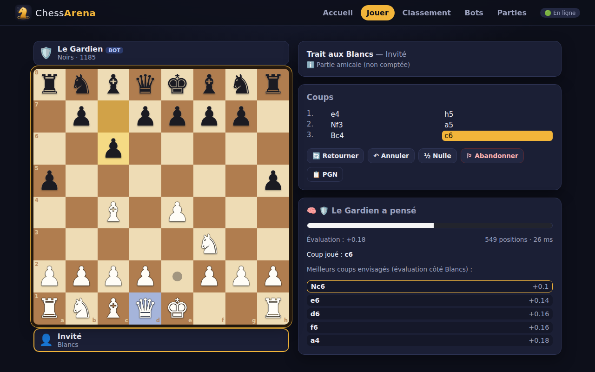
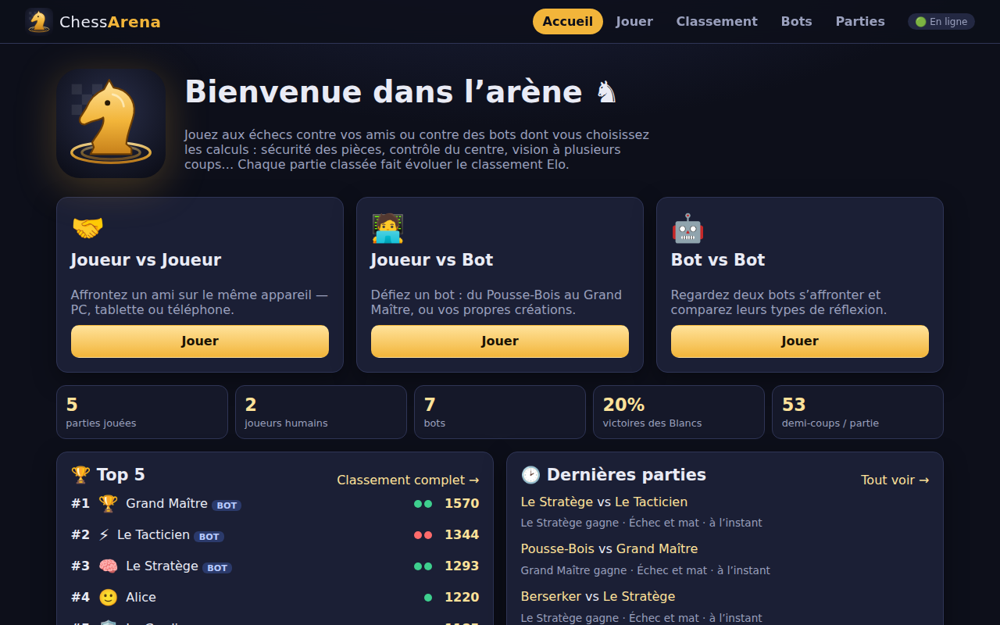
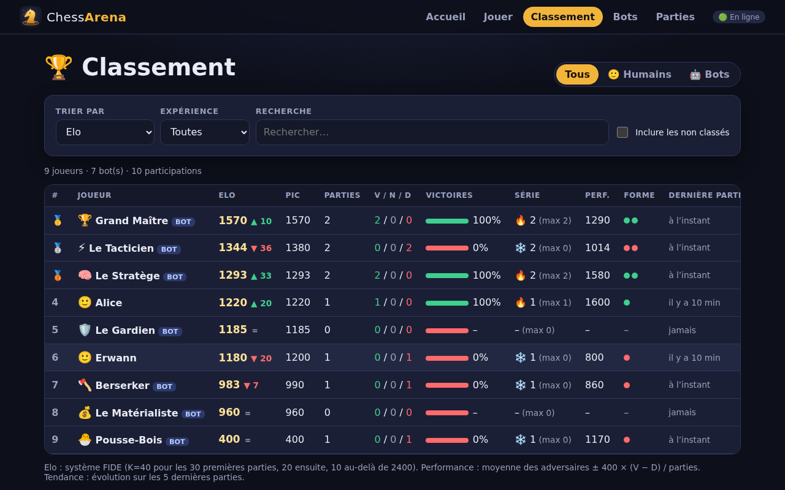
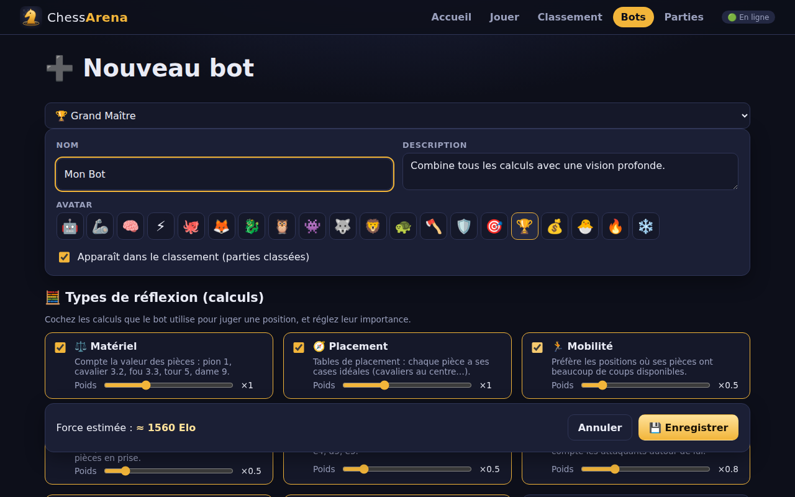
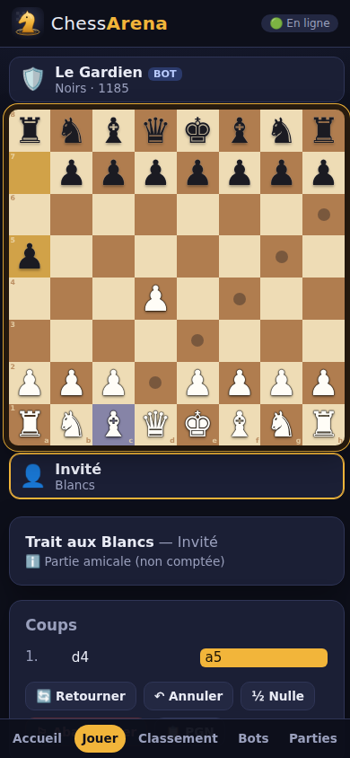

<div align="center">


# ChessArena

**Échecs PvP · PvE · EvE — des bots dont vous choisissez la façon de réfléchir, et un classement Elo ultra détaillé.**

[](https://github.com/ErwannL/ChessArena/actions/workflows/ci.yml)


[](LICENSE)



</div>

---

## ✨ Fonctionnalités

- ♟️ **Trois modes** : Joueur vs Joueur (sur le même appareil), Joueur vs Bot, Bot vs Bot (séries avec couleurs alternées, vitesse réglable, pause).
- 🧠 **Bots à calculs paramétrables** — à la création d'un bot, on lui affecte un ou plusieurs types de réflexion, chacun pondéré :
  matériel, placement, mobilité, **sécurité des pièces** (attaquées ? défendues ?), contrôle du centre, sécurité du roi, structure de pions, développement, agressivité, finale…
  plus la **vision à plusieurs coups d'avance** (alpha-bêta), le calcul des échanges (quiescence) et une part d'imprévu.
  Le panneau « réflexion » montre l'évaluation et les coups envisagés.
- 🏆 **Classement Elo détaillé** : tendance, pic, V/N/D, % de victoires, séries, performance, forme, filtres humains / bots / non classés, 7 tris, recherche. Profils avec courbe Elo, stats Blancs/Noirs et face-à-face.
  Les bots peuvent être **dans le classement ou non**.
- 🎞️ Historique, **relecture** des parties (clavier ← →), export **PGN**.
- 📱 **PC, tablette, téléphone** : échiquier tactile (tap ou glisser-déposer), navigation mobile, installable en **PWA**.
- 🔌 **Mode hors-ligne** automatique si le serveur est injoignable (données dans le navigateur).
- 🛡️ Serveur autoritaire : chaque partie est **rejouée coup par coup** avant d'être comptée.
- 🐳 **Docker** prêt pour la prod (image non-root, healthcheck, volume persistant).
- ✅ **100 % de couverture** (lignes, branches, fonctions) + tests e2e desktop & mobile en CI.

## 🚀 Démarrage rapide

### Avec Docker (recommandé)

```bash
docker compose up -d
# → http://localhost:3000   (depuis un téléphone du même réseau : http://<ip-du-pc>:3000)
```

Les données (joueurs, bots, parties) sont conservées dans le volume `chessarena-data`.

<details>
<summary>Sans docker-compose</summary>

```bash
docker build -t chessarena .
docker run -d -p 3000:3000 -v chessarena-data:/data --name chessarena chessarena
```

Ou l'image publiée à chaque release : `ghcr.io/erwannl/chessarena:latest`.

</details>

### En local (Node ≥ 20)

```bash
npm install
npm run dev        # API :3000 + interface Vite :5173 avec rechargement à chaud
```

```bash
npm run build && npm start   # version de production sur :3000
```

| Variable     | Défaut                 | Rôle                                   |
| ------------ | ---------------------- | -------------------------------------- |
| `PORT`       | `3000`                 | Port HTTP                              |
| `DATA_DIR`   | `data`                 | Dossier de la base JSON (`arena.json`) |
| `DATA_FILE`  | `$DATA_DIR/arena.json` | Chemin complet de la base              |
| `STATIC_DIR` | `dist/web`             | Client web servi                       |

## 📸 Aperçu

| Accueil                                                        | Classement                                                    |
| -------------------------------------------------------------- | ------------------------------------------------------------- |
|                |     |
| **Atelier de bots**                                            | **Sur téléphone**                                             |
|  |  |

## 🧠 Comment pensent les bots ?

```
score(position) = Σ poids × calcul(position)        (en centipions)
coup joué       = meilleur score après N demi-coups d'avance (alpha-bêta)
```

| Bot modèle         | Calculs                                           | Vision       |
| ------------------ | ------------------------------------------------- | ------------ |
| 🐣 Pousse-Bois     | matériel, très aléatoire                          | 1            |
| 💰 Le Matérialiste | matériel                                          | 2            |
| 🛡️ Le Gardien      | matériel, sécurité des pièces, sécurité du roi    | 2 + échanges |
| 🪓 Berserker       | matériel, agressivité, mobilité                   | 2            |
| 🧠 Le Stratège     | matériel, placement, centre, développement, pions | 2 + échanges |
| ⚡ Le Tacticien    | matériel, placement, sécurité                     | 3 + échanges |
| 🏆 Grand Maître    | 9 calculs combinés                                | 3 + échanges |

Ajouter un nouveau type de calcul = écrire une fonction et l'enregistrer : tout le reste (API, atelier, validation) suit. 👉 [docs/BOTS.md](docs/BOTS.md)

## 🧪 Qualité

```bash
npm run check      # typecheck + ESLint + Prettier + Vitest avec seuil de couverture à 100 %
npm run e2e        # Playwright (desktop + mobile) — nécessite `npm run build`
```

- **Perft** sur 6 positions de référence pour garantir la génération de coups.
- 100 % de couverture sur tout le code métier (`src/`) et le serveur (`server/`), imposée par la CI.

## 🗂️ Documentation

| Document                                                                                       | Contenu                                                  |
| ---------------------------------------------------------------------------------------------- | -------------------------------------------------------- |
| [docs/ARCHITECTURE.md](docs/ARCHITECTURE.md)                                                   | Vue d'ensemble, arborescence, choix techniques           |
| [docs/BOTS.md](docs/BOTS.md)                                                                   | Calculs, recherche, bots modèles, ajouter un calcul      |
| [docs/RATING.md](docs/RATING.md)                                                               | Elo, parties classées / amicales, colonnes du classement |
| [docs/API.md](docs/API.md)                                                                     | API REST                                                 |
| [docs/GIT_WORKFLOW.md](docs/GIT_WORKFLOW.md)                                                   | Branches, commits, SemVer, releases                      |
| [CONTRIBUTING.md](CONTRIBUTING.md) · [CHANGELOG.md](CHANGELOG.md) · [SECURITY.md](SECURITY.md) |                                                          |

## 🛣️ Idées pour la suite

- Nouveaux calculs : colonnes ouvertes, paire de fous, cases faibles, tables d'ouvertures.
- Table de transposition et approfondissement itératif pour des bots plus forts.
- Pendule (blitz / rapide) et Elo par cadence.
- Tournois automatiques toutes rondes entre bots.
- Comptes utilisateurs et parties en ligne à distance.

## 📄 Licence

[MIT](LICENSE) © ErwannL
