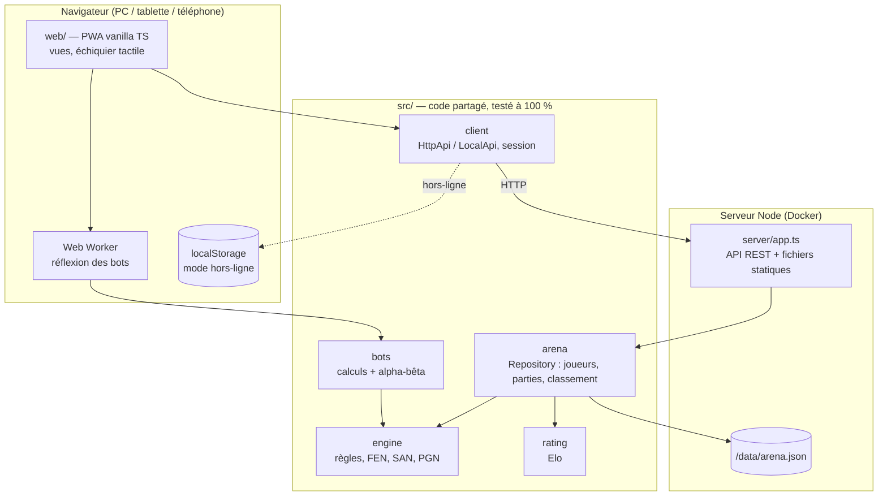

# 🏗️ Architecture

ChessArena est écrit en **TypeScript de bout en bout**, sans framework côté client ni côté serveur :
le même code (moteur, bots, Elo, règles d'enregistrement) tourne dans le navigateur, dans un Web Worker et sur le serveur Node.

## Arborescence

| Dossier      | Rôle                                                                                                                                                    |
| ------------ | ------------------------------------------------------------------------------------------------------------------------------------------------------- |
| `src/engine` | Règles complètes : roque, prise en passant, promotion, mat/pat, 50 coups, triple répétition, matériel insuffisant, FEN, SAN, PGN. Validé par **perft**. |
| `src/bots`   | Calculs (heuristiques), contexte d'évaluation partagé (carte d'attaques), recherche négamax alpha-bêta + quiescence, bots modèles.                      |
| `src/rating` | Elo (K variable, plancher, performance).                                                                                                                |
| `src/arena`  | `Repository` : création/édition de joueurs et bots, **validation des parties par rejeu**, statistiques détaillées, classement.                          |
| `src/client` | `HttpApi` (serveur), `LocalApi` (localStorage, mêmes règles), détection automatique, `GameSession`.                                                     |
| `server`     | Serveur HTTP Node natif : routes REST, persistance JSON atomique, SPA statique sécurisée (anti path-traversal).                                         |
| `web`        | Interface : échiquier (tap & glisser-déposer), jeu, atelier de bots, classement, profils, relecture.                                                    |
| `tests`      | Tests unitaires/intégration Vitest — **100 % lignes / branches / fonctions**.                                                                           |
| `e2e`        | Scénarios Playwright sur desktop et mobile.                                                                                                             |

## Choix techniques

- **Zéro dépendance d'exécution** : l'image Docker ne contient que `dist/` (bundle serveur de ~50 ko + client statique).
- **Réflexion des bots dans un Web Worker** : l'interface reste fluide sur téléphone même quand le Grand Maître calcule.
- **Mode hors-ligne** : si le serveur ne répond pas (hébergement statique, avion…), l'application bascule sur `LocalApi` qui applique exactement les mêmes règles.
- **Serveur autoritaire** : les parties sont rejouées coup par coup avant d'être comptées.
- **Performances** : carte d'attaques calculée une seule fois par position et partagée entre les calculs, tri MVV-LVA, fenêtre alpha-bêta à la racine, budget de nœuds.
