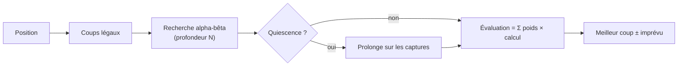

# 🧠 Les bots et leurs « calculs »

Un bot ChessArena, c'est **une liste de calculs pondérés + une manière de chercher**.
À chaque coup il :

1. génère tous les coups légaux ;
2. pour chacun, **regarde plusieurs coups d'avance** (arbre de recherche _alpha-bêta_) ;
3. aux feuilles de l'arbre, **évalue la position** en additionnant ses calculs :
   `score = Σ poids × calcul(position)` (en centipions, 100 = un pion) ;
4. joue le coup qui mène au meilleur score (avec éventuellement une part d'imprévu).



## Les types de calcul disponibles

| Id              | Nom                | Ce qu'il mesure                                                                                                                |
| --------------- | ------------------ | ------------------------------------------------------------------------------------------------------------------------------ |
| `material`      | ⚖️ Matériel        | Somme de la valeur des pièces (P 100, C 320, F 330, T 500, D 900).                                                             |
| `positional`    | 🧭 Placement       | Tables de placement : cavaliers au centre, tours en 7e, roi abrité en milieu de partie et actif en finale.                     |
| `mobility`      | 🏃 Mobilité        | Nombre de coups disponibles de chaque camp.                                                                                    |
| `safety`        | 🛡️ Sécurité        | **Analyse des pièces importantes** : attaquées ? défendues ? attaquées par moins fort qu'elles ? Pénalise les pièces en prise. |
| `center`        | 🎯 Centre          | Occupation et contrôle de d4/e4/d5/e5 (et du centre élargi).                                                                   |
| `kingSafety`    | 👑 Sécurité du roi | Bouclier de pions, colonne ouverte, attaquants autour du roi (pèse plus en milieu de partie).                                  |
| `pawnStructure` | ⛓️ Pions           | Pions doublés / isolés pénalisés, pions passés récompensés (de plus en plus en avançant).                                      |
| `development`   | 🚀 Développement   | Sortir les pièces mineures, roquer, ne pas sortir la dame trop tôt (s'efface en finale).                                       |
| `aggression`    | ⚔️ Agressivité     | Attaquer des pièces adverses et mettre le roi en échec.                                                                        |
| `endgame`       | 🏁 Finale          | Centraliser son roi et, avec l'avantage, repousser le roi adverse au bord pour mater.                                          |

Chaque calcul reçoit un **poids de 0,1 à 3** dans l'atelier.

## Les paramètres de recherche

| Paramètre    | Effet                                                                                                                       |
| ------------ | --------------------------------------------------------------------------------------------------------------------------- |
| `depth`      | **Voir plusieurs coups d'avance** : nombre de demi-coups explorés (1 à 5). 2 = « je joue, il répond ».                      |
| `quiescence` | Après la profondeur normale, continue tant qu'il y a des captures : évite de s'arrêter au milieu d'un échange.              |
| `randomness` | Marge (centipions) dans laquelle un coup moins bon peut être choisi au hasard : rend le bot plus humain. Jamais sur un mat. |

Les positions déjà rencontrées dans la partie sont comptées comme nulles : un bot gagnant évite la triple répétition.

## Les bots de départ

| Bot                | Calculs                                           | Profondeur | Quiescence | Imprévu |
| ------------------ | ------------------------------------------------- | ---------- | ---------- | ------- |
| 🐣 Pousse-Bois     | matériel                                          | 1          | –          | 400     |
| 💰 Le Matérialiste | matériel                                          | 2          | –          | 20      |
| 🛡️ Le Gardien      | matériel, sécurité ×1.5, sécurité du roi          | 2          | ✔          | 10      |
| 🪓 Berserker       | matériel, agressivité ×2.5, mobilité              | 2          | –          | 40      |
| 🧠 Le Stratège     | matériel, placement, centre, développement, pions | 2          | ✔          | 0       |
| ⚡ Le Tacticien    | matériel, placement ×0.5, sécurité                | 3          | ✔          | 0       |
| 🏆 Grand Maître    | 9 calculs combinés                                | 3          | ✔          | 0       |

## ➕ Ajouter un nouveau type de calcul

1. Dans [`src/bots/heuristics.ts`](../src/bots/heuristics.ts), écrire un objet `Heuristic` :

   ```ts
   export const rooksOnOpenFiles: Heuristic = {
     id: 'openFiles',
     name: 'Colonnes ouvertes',
     icon: '🗼',
     description: 'Place ses tours sur les colonnes sans pions.',
     evaluate(ctx) {
       // Score en centipions, du point de vue des BLANCS (positif = bon pour les Blancs).
       // ctx.pos (position), ctx.moves(color), ctx.attacks(color), ctx.phase(), ctx.material()
       return 0;
     },
   };
   ```

2. L'ajouter au tableau `HEURISTICS` (ou appeler `registerHeuristic()` à l'exécution).
3. Écrire ses tests dans `tests/bots.test.ts` (la CI exige **100 % de couverture**).

C'est tout : l'API `/api/heuristics`, l'atelier de bots et la validation des configurations le découvrent automatiquement.
