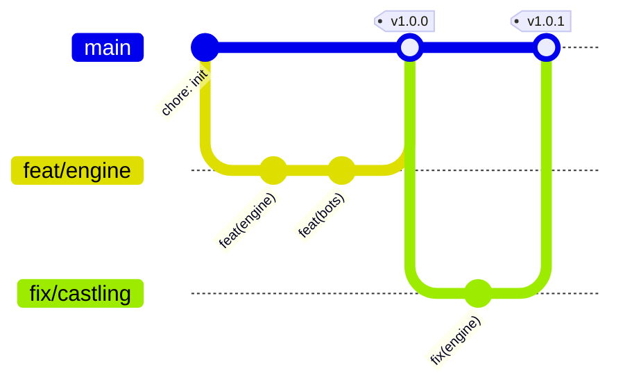

# 🌿 Workflow Git & versionnement

## Branches

| Branche                                   | Rôle                                                                                 |
| ----------------------------------------- | ------------------------------------------------------------------------------------ |
| `main`                                    | Toujours stable et déployable. Protégée : merge **uniquement via PR** avec CI verte. |
| `feat/<sujet>`                            | Nouvelle fonctionnalité (ex. `feat/bot-open-files`)                                  |
| `fix/<sujet>`                             | Correction de bug                                                                    |
| `docs/…`, `ci/…`, `refactor/…`, `chore/…` | Le reste                                                                             |



## Commits : Conventional Commits

```
<type>(<portée>): <résumé à l'impératif>
```

Types : `feat`, `fix`, `perf`, `refactor`, `test`, `docs`, `build`, `ci`, `chore`.
Portées usuelles : `engine`, `bots`, `rating`, `server`, `client`, `web`, `docker`.

## Versions : SemVer

- `MAJEUR` : changement incompatible (format de la base, API).
- `MINEUR` : nouvelle fonctionnalité (ex. un nouveau type de calcul).
- `CORRECTIF` : correction.

## Publier une version

1. Mettre à jour `CHANGELOG.md` et `version` dans `package.json`.
2. `git tag v1.1.0 && git push origin v1.1.0`
3. Le workflow **Release** publie l'image `ghcr.io/erwannl/chessarena:1.1.0` (+ `latest`) et crée la release GitHub avec les notes générées.

## Protection de `main` (à activer dans Settings → Branches)

- Require a pull request before merging
- Require status checks : `Lint, types & tests (100 % coverage)`, `End-to-end (desktop + mobile)`, `Docker image`
- Require linear history (squash merge recommandé)
